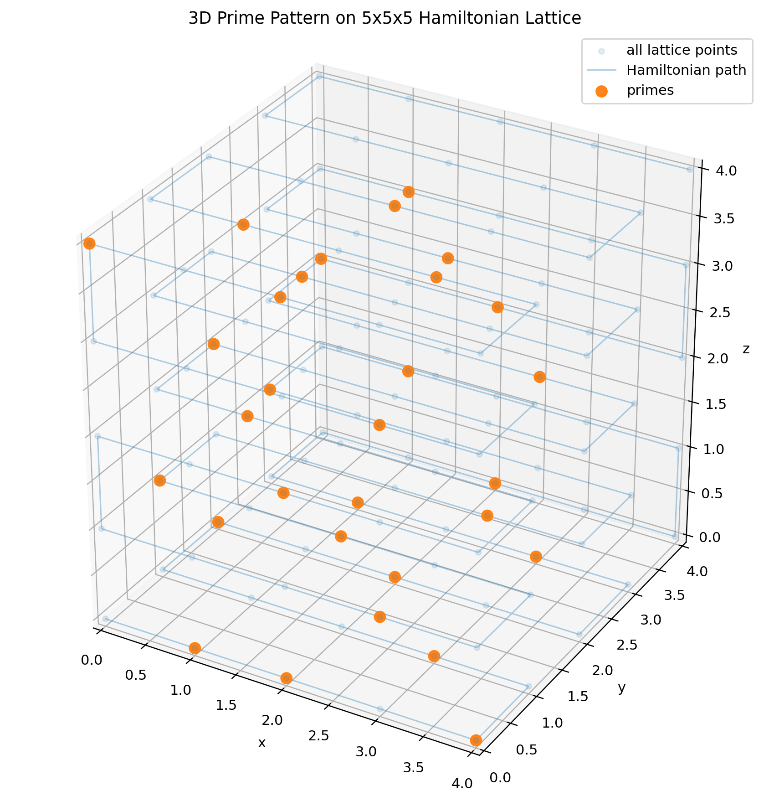
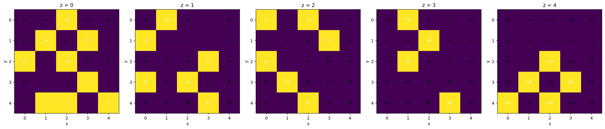
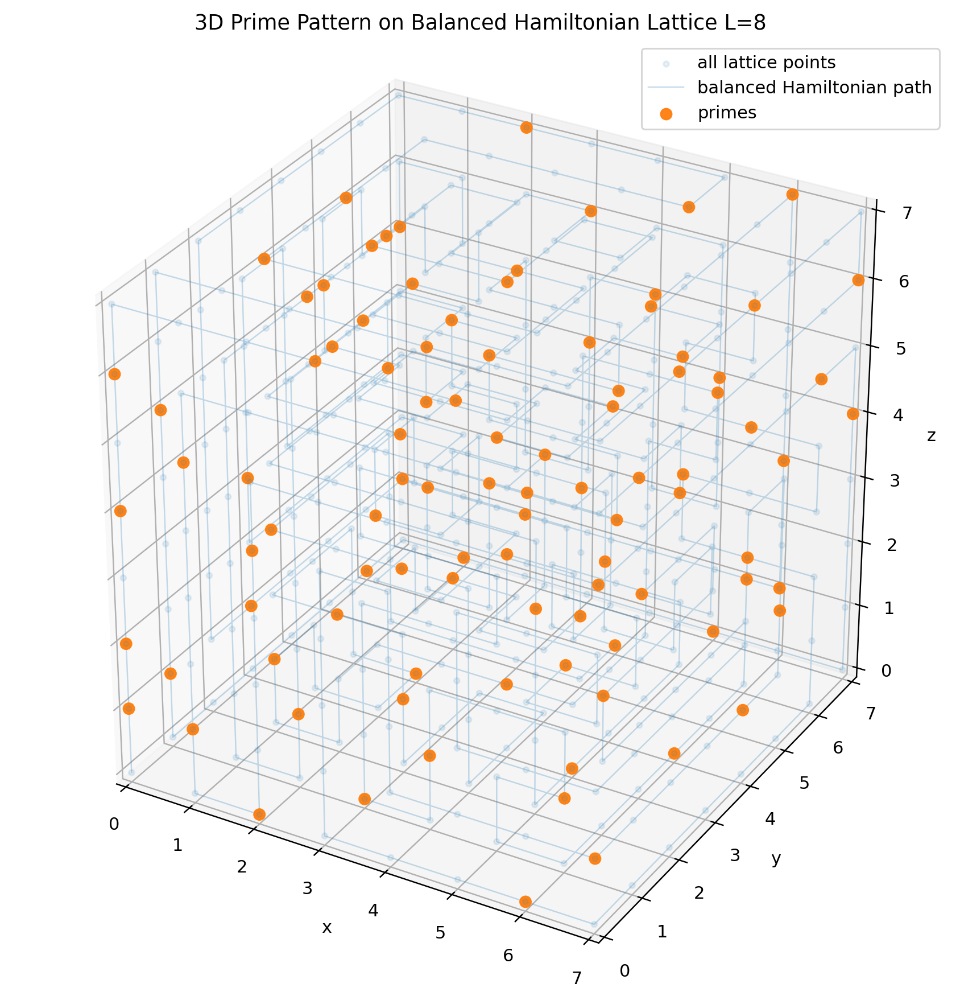
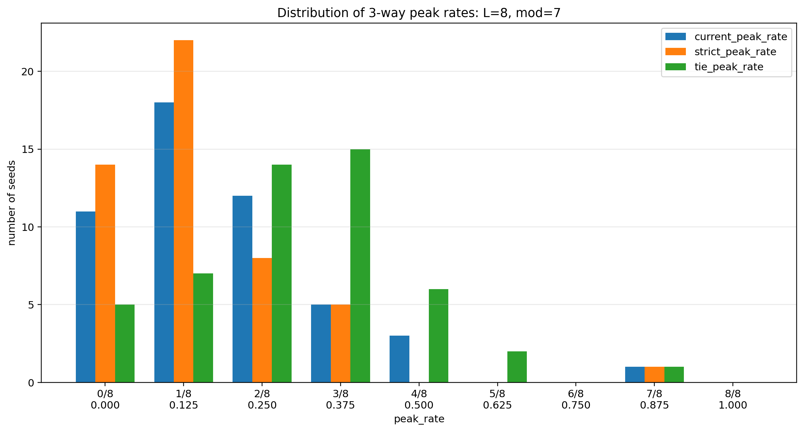

# 3D Hamiltonian Prime Lattice Experiments

## 概要

このリポジトリは、3次元格子 `L × L × L` 上にハミルトン路を構成し、その経路に沿って整数


$$
1, 2, \ldots, L^3
$$

を配置したときに現れる、素数配置・剰余分布・斜め平面上の合同式的な構造を調べるための計算実験ノートです。

最初の観測対象は **Snake型ハミルトン路** でした。その後、Snake型に特有の現象かどうかを調べるため、**方向均衡ハミルトン路** との比較実験も追加しました。

---

## 現在の状態

これはまだ証明済みの定理ではありません。  
現時点では、計算実験に基づく観測・予想・比較結果です。

---

## 基本設定

3次元格子点を

$$
(x,y,z), \quad 0 \le x,y,z < L
$$

とします。

ハミルトン路に沿って各格子点に整数 `n` を割り当てます。斜め平面を

$$
s = x+y+z
$$

で定義し、各斜め平面上の奇数番号 `n` の剰余分布を調べます。

---

## Figure

### Figure 1. Prime positions on a 3D Snake-type Hamiltonian lattice



### Figure 2. Prime positions by z-layers



### Figure 3. Prime positions on a direction-balanced Hamiltonian lattice



### Figure. Distribution of 3-way peak rates for balanced Hamiltonian paths



---

## 観測1: Snake型ハミルトン配置の合同ピーク

Snake型ハミルトン配置において、法 `m` に対して

$$
L \equiv 1 \pmod m
$$

となる場合、斜め平面 `x+y+z=s` 上の奇数番号 `n` の剰余分布で、最多剰余 `peak_r` が

$$
peak_r \equiv s+1 \pmod m
$$

となるケースが多数観測されました。

### 主な観測例

| L | mod | L % mod | match / total | rate |
|---:|---:|---:|---:|---:|
| 6 | 5 | 1 | 5/5 | 1.000 |
| 8 | 7 | 1 | 8/8 | 1.000 |
| 11 | 5 | 1 | 12/12 | 1.000 |
| 12 | 11 | 1 | 14/14 | 1.000 |
| 15 | 7 | 1 | 18/18 | 1.000 |
| 16 | 3 | 1 | 20/20 | 1.000 |
| 16 | 5 | 1 | 20/20 | 1.000 |
| 21 | 5 | 1 | 27/27 | 1.000 |
| 22 | 3 | 1 | 29/29 | 1.000 |
| 22 | 7 | 1 | 29/29 | 1.000 |
| 23 | 11 | 1 | 30/30 | 1.000 |
| 26 | 5 | 1 | 35/35 | 1.000 |
| 29 | 7 | 1 | 39/39 | 1.000 |
| 34 | 3 | 1 | 47/47 | 1.000 |
| 34 | 11 | 1 | 47/47 | 1.000 |

一方で、`L % mod != 1` の場合は一致率が低い例が多く観測されました。

| L | mod | L % mod | match / total | rate |
|---:|---:|---:|---:|---:|
| 9 | 7 | 2 | 2/9 | 0.222 |
| 11 | 7 | 4 | 2/12 | 0.167 |
| 29 | 5 | 4 | 1/39 | 0.026 |

---

## 観測2: 方向均衡ハミルトン路との比較

Snake型で見えた合同ピークが、3次元格子ハミルトン路一般の性質なのか、それとも Snake型走査に依存する性質なのかを調べるため、方向均衡寄りのハミルトン路を生成して比較しました。

方向均衡ハミルトン路では、x方向・y方向・z方向の移動回数がなるべく均等になるように探索的に経路を生成しています。

例として、`L=8` では総移動数は `8^3 - 1 = 511` です。方向均衡型では、代表的に

```text
move_counts = {'x': 170, 'y': 170, 'z': 171}
```

のように、ほぼ `1/3` ずつの移動回数になります。

---

## peak_rate の3種類の定義

剰余分布で最大値が複数ある場合、単純に `counts.index(max_count)` を使うと、最初に見つかった剰余だけがピークとして扱われます。  
そのため、今回から peak_rate を次の3種類に分けました。

| 指標 | 意味 |
|---|---|
| `current_peak_rate` | 既存方式。`counts.index(max_count) == expected_r` となる割合 |
| `strict_peak_rate` | `expected_r` が単独ピークになる割合 |
| `tie_peak_rate` | `expected_r` が同率ピーク集合に含まれる割合 |

ここで

$$
expected_r \equiv s+1 \pmod m
$$

です。

---

## 方向均衡型 `L=8, mod=7` の50 seed 実験

`L=8, mod=7`、seed `0..49` の50本の方向均衡ハミルトン路について、3種類の peak_rate を集計しました。

| 指標 | 平均値 |
|---|---:|
| `current_peak_rate` | 0.190 |
| `strict_peak_rate` | 0.150 |
| `tie_peak_rate` | 0.302 |

この結果から、Snake型のような強い `rate=1.000` の合同ピークは、方向均衡型では通常は再現されにくいことが分かりました。

ただし、同率ピークを含めると `tie_peak_rate` は `0.302` まで上がります。つまり、方向均衡型でも「弱い合同ピーク」や「出かけている構造」は一定数存在します。

### 代表例

| seed | current | strict | tie | 解釈 |
|---:|---:|---:|---:|---|
| 34 | 0.875 | 0.875 | 0.875 | 単独ピークとして強く出る代表例 |
| 47 | 0.125 | 0.125 | 0.625 | currentでは低いが、同率ピークとしてはかなり強い例 |
| 22 | 0.375 | 0.125 | 0.625 | 同率ピークが多い例 |
| 1 | 0.000 | 0.000 | 0.000 | 合同ピークがほぼ出ない例 |

---

## modular alignment という見方

合同ピーク現象を直接見るため、次の量を定義します。

$$
e \equiv n - (x+y+z+1) \pmod m
$$

斜め平面 `s=x+y+z` 上では、これは

$$
e \equiv n - (s+1) \pmod m
$$

です。

`e=0` が多いほど、

$$
n \equiv s+1 \pmod m
$$

に近い配置になっています。

特に重要なのは、全体として `e=0` が多いかだけではなく、各斜め平面ごとに `e=0` が局所的にピークになっているかです。

---

## 現時点の解釈

現時点では、次のように整理できます。

1. Snake型ハミルトン配置では、`L ≡ 1 mod m` のとき、`peak_r ≡ s+1 mod m` が非常に強く出る。
2. 方向均衡ハミルトン路では、この現象は一般には弱くなる。
3. ただし、方向均衡型でも一部の seed では強い合同ピークが出る。
4. 合同ピークの本体は、経路の見た目や方向移動回数だけではなく、
   
   $$
   e \equiv n-(x+y+z+1) \pmod m
   $$
   
   の局所的な優勢に関係している可能性が高い。
5. 今後は `strict_peak_rate` と `tie_peak_rate` を主指標として扱うのがよい。

---

## 素数模様との関係

`m` が素数 `p` のとき、

$$
s+1 \equiv 0 \pmod p
$$

となる斜め平面では、`p` の倍数が多く配置されるため、素数密度が低下する可能性があります。

これは、2次元ウラム螺旋において、線上の数列が多項式となり、その合同性によって素数の出やすさが変わる現象と似ています。

---

## リポジトリ構成

```text
3D_Serpentine_Hamiltonian_pub/
├─ README.md
├─ notes/
│  ├─ 2026-05-04_modular_residue_peak_note.md
│  └─ 2026-05-04_balanced_peak_rate_3way_note.md
├─ src/
│  ├─ 12_hamiruton.py
│  └─ 22_hamiruton_balanced.py
├─ logs/
│  ├─ 12.txt
│  └─ 22.txt
├─ images/
│  ├─ figure1_prime_lattice_L5.png
│  └─ figure2_prime_layers_L5.png
└─ images_balanced/
   └─ figure_balanced_prime_lattice_L8.png
```
## ファイル説明

| パス | 種別 | 説明 |
|---|---|---|
| `README.md` | 概要文書 | このリポジトリ全体の概要、観測した現象、実験結果、今後の予定をまとめた入口文書です。 |
| `notes/2026-05-04_modular_residue_peak_note.md` | 研究ノート | Snake型ハミルトン路で最初に観測した、`L ≡ 1 mod m` のときの合同剰余ピーク現象を記録した初期ノートです。 |
| `notes/2026-05-04_balanced_peak_rate_3way_note.md` | 研究ノート | 方向均衡ハミルトン路との比較実験、および `current_peak_rate` / `strict_peak_rate` / `tie_peak_rate` の3種類の指標を整理した発展ノートです。 |
| `src/12_hamiruton.py` | Pythonコード | Snake型ハミルトン路を構成し、3D格子上に整数を配置して、素数点・斜め平面ごとの剰余ピーク・合同構造を調べるための初期実験コードです。 |
| `src/22_hamiruton_balanced.py` | Pythonコード | 方向均衡寄りの3Dハミルトン路を生成し、Snake型との比較、seed sweep、modular alignment、3種類の peak_rate 指標を解析する発展版コードです。 |
| `logs/12.txt` | 実験ログ | `src/12_hamiruton.py` によるSnake型ハミルトン配置の実行結果を保存したログです。 |
| `logs/22.txt` | 実験ログ | `src/22_hamiruton_balanced.py` による方向均衡ハミルトン路の `L=8, mod=7, seed=0..49` 実験結果を保存したログです。 |
| `images/figure1_prime_lattice_L5.png` | 図 | `L=5` のSnake型ハミルトン格子上における素数点の3D表示です。 |
| `images/figure2_prime_layers_L5.png` | 図 | `L=5` のSnake型ハミルトン格子について、素数点をz層ごとに分けて表示した図です。 |
| `images_balanced/figure_balanced_prime_lattice_L8.png` | 図 | `L=8` の方向均衡ハミルトン路上における素数点の3D表示です。 |

## 実験の流れ

このリポジトリでは、主に次の順番で実験を進めています。

1. `src/12_hamiruton.py` で Snake型ハミルトン路を作る。
2. 経路に沿って `1,2,...,L^3` を3D格子点へ配置する。
3. 素数だけを3D上に表示する。
4. 斜め平面 `s=x+y+z` ごとに、奇数番号 `n` の剰余分布を調べる。
5. Snake型で見えた合同ピークが一般的な性質かを調べるため、`src/22_hamiruton_balanced.py` で方向均衡ハミルトン路と比較する。
6. `current_peak_rate` / `strict_peak_rate` / `tie_peak_rate` の3種類の指標で、合同ピークの強さを評価する。

## 主要コードの役割

### `src/12_hamiruton.py`

Snake型ハミルトン路を基準モデルとして扱うコードです。

このコードでは、3D格子 `L × L × L` をSnake状に一筆書きし、その順番に整数を配置します。その後、素数点の可視化や、斜め平面ごとの剰余分布を調べます。

主に、次の現象を観測するために使います。

```text
L ≡ 1 mod m のとき、
peak_r ≡ s+1 mod m
が強く現れるか
---

## 実行例

```powershell
python src/22_hamiruton_balanced.py
```

または環境に合わせて：

```powershell
& C:/Users/su5fi/AppData/Local/Programs/Python/Python311/python.exe src/22_hamiruton_balanced.py
```

---

## 注意

現時点では、以下は未完了です。

- 一般の場合の証明
- 反例探索
- 既存研究との詳細比較
- 方向均衡ハミルトン路以外の経路族との比較
- ランダムなハミルトン路全体に対する統計的検証
- Snake型配置の明示的な番号式の導出

---

## 今後の予定

1. Snake型配置の番号式を導出する
2. `L ≡ 1 mod m` のときの剰余分布を証明する
3. `strict_peak_rate` / `tie_peak_rate` を Snake型にも適用する
4. 方向均衡型について `L` と `mod` を増やして seed sweep する
5. 他のハミルトン路生成法と比較する
6. 反例探索を行う
7. 3D可視化画像・動画を作成する

---

## Notes

- `notes/2026-05-04_modular_residue_peak_note.md`  
  Snake型ハミルトン配置における合同剰余ピークの初期観測ノート。

- `notes/2026-05-04_balanced_peak_rate_3way_note.md`  
  方向均衡ハミルトン路との比較、および `current / strict / tie` の3種類の peak_rate 指標を整理したノート。

---
## ライセンス

License: To be determined.
