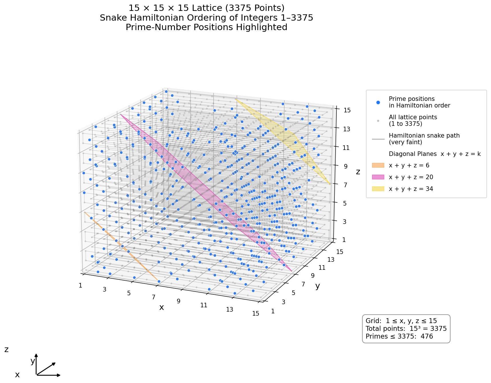

# 3D Hamiltonian Prime Lattice Experiments

## 概要

このリポジトリは、3次元格子 `L × L × L` 上にハミルトン路を構成し、その経路に沿って整数


$$
1, 2, \ldots, L^3
$$

を配置したときに現れる、素数配置・剰余分布・斜め平面上の合同式的な構造を調べるための計算実験ノートです。

最初の観測対象は **Snake型ハミルトン路** でした。その後、Snake型に特有の現象かどうかを調べるため、**方向均衡ハミルトン路** との比較実験も追加しました。

---


## 観測命題 / 予想（定理候補）

本リポジトリで中心的に調べている現象は、次の観測命題です。

> **3D Snake型ハミルトン配置の合同ピーク予想**  
> `L × L × L` の3次元格子に Snake型ハミルトン路で整数  
> `1, 2, ..., L^3`  
> を配置する。  
> 法 `m` に対して
>
> $$
> L \equiv 1 \pmod m
> $$
>
> が成り立つとき、斜め平面
>
> $$
> x+y+z=s
> $$
>
> 上に配置された奇数番号 `n` の剰余分布では、最多剰余 `peak_r` が
>
> $$
> peak_r \equiv s+1 \pmod m
> $$
>
> となるケースが多数観測される。

この命題は、現時点ではまだ証明済みの定理ではありません。  
計算実験に基づく **観測命題・予想** です。

ただし、複数の `L` と `m` に対して、特に `L % m = 1` の場合に高い一致率が観測されているため、今後、Snake型配置の番号式を導出することで、証明可能な小定理へ発展する可能性があります。

また、`m=p` が素数であり、

$$
s+1 \equiv 0 \pmod p
$$

となる斜め平面では、`p` の倍数が相対的に多く配置されるため、素数密度が低下しやすい可能性があります。  
これは、3D格子上に現れる素数の縞模様や欠乏平面を説明する手がかりになると考えています。

> 追記: 2026-05-05  
> Snake型ハミルトン配置については、条件を
>
> - `m` は奇数、`m >= 3`
> - `L ≡ 1 (mod m)`
> - 偶数斜め平面 `x+y+z=s`
> - 同率ピークを許す弱版
>
> に限定した場合、`n ≡ s+1 (mod m)` の剰余クラスが最多剰余クラスの1つになることを、領域分割により証明整理しました。
>
> 証明ノート:
> [`notes/2026-05-05_weak_congruence_peak_theorem_odd_m.md`](notes/2026-05-05_weak_congruence_peak_theorem_odd_m.md)
> 

---
### 証明済みの部分

Snake型ハミルトン配置について、次の条件では弱合同ピーク定理として証明を整理した。

- `m` は奇数、`m >= 3`
- `L ≡ 1 (mod m)`
- 偶数斜め平面 `x+y+z=s`
- 同率ピークを許す弱版

証明ノート:
`notes/2026-05-05_weak_congruence_peak_theorem_odd_m.md`

---

## 現在の状態

現時点では、次のように整理しています。

- Snake型ハミルトン配置について、`m` が奇数、`m >= 3`、`L ≡ 1 (mod m)` の場合、同率ピークを許す弱版の合同ピーク定理を証明整理しました。
- 証明ノートは `notes/2026-05-05_weak_congruence_peak_theorem_odd_m.md` にまとめています。
- ただし、偶数 `m`、単独ピーク版、Snake型以外の一般ハミルトン路については未証明です。
- 方向均衡ハミルトン路については、Snake型現象との比較実験として扱っています。

---

## 基本設定

3次元格子点を

$$
(x,y,z), \quad 0 \le x,y,z < L
$$

とします。

ハミルトン路に沿って各格子点に整数 `n` を割り当てます。斜め平面を

$$
s = x+y+z
$$

で定義し、各斜め平面上の奇数番号 `n` の剰余分布を調べます。

---
## Figure

この章では、本リポジトリで行った計算実験の可視化結果を示します。

Figure 1 と Figure 2 は、最初の基準モデルである **Snake型ハミルトン路** による整数配置を可視化したものです。  
Snake型では、3D格子を層ごとにジグザグに走査し、その一筆書き順に整数 `1,2,...,L^3` を配置します。  
この配置で素数がどのように現れるかを、まず小さい `L=5` の格子で確認しています。

Figure 3 は、Snake型との比較対象として作成した **方向均衡ハミルトン路** の可視化です。  
方向均衡型では、x方向・y方向・z方向への移動回数がなるべく均等になるように経路を生成します。  
これにより、Snake型で見えた合同ピーク現象が、Snake型特有の走査順序に依存するのかを調べます。

Figure 4 は、方向均衡ハミルトン路に対する `current_peak_rate` / `strict_peak_rate` / `tie_peak_rate` の分布を示した図です。  
これは、合同ピークが「単独ピーク」として強く出ているのか、それとも「同率ピーク」として弱く残っているのかを比較するための図です。

Figure 5 は、Snake型ハミルトン配置において、素数位置と代表的な斜め平面 `x+y+z=s` を同時に表示した図です。  
観測1で扱う合同剰余ピークは、このような斜め平面ごとの剰余分布に注目しています。  
特に `L=15, mod=7` の場合、`x+y+z=6,20,34` は合同構造や素数密度の変化を観察するための代表的な平面です。

以下の図は、いずれも「3D格子上の一筆書き順序」と「素数・剰余分布・斜め平面」の関係を理解するための補助図です。


### Figure 1. Prime positions on a 3D Snake-type Hamiltonian lattice


この図では、`5 × 5 × 5` の3D格子に Snake型ハミルトン路で整数 `1..125` を配置し、そのうち素数に対応する格子点を強調表示しています。  
Snake型の規則的な一筆書き順序に沿って整数を配置したとき、素数点が3D空間内でどのように現れるかを確認するための基本図です。  

関連コード: `src/02_hamiruton_2.py`

---

### Figure 2. Prime positions by z-layers


この図では、`5 × 5 × 5` の3D格子を `z` 層ごとに分解し、各層に配置された整数と素数位置を表示しています。  
3D表示だけでは見えにくい層ごとの配置を確認できるため、Snake型ハミルトン路による番号付けと、素数位置の関係を平面的に観察できます。  

関連コード: `src/02_hamiruton_2.py`

---

### Figure 3. Prime positions on a direction-balanced Hamiltonian lattice


この図では、`8 × 8 × 8` の3D格子に方向均衡ハミルトン路で整数を配置し、素数位置を強調表示しています。  
方向均衡ハミルトン路では、x方向・y方向・z方向への移動回数がなるべく均等になるように経路を生成しています。  
Snake型ハミルトン路で観測された合同ピークが、より方向バランスの良い経路でも現れるかを比較するための図です。  

関連コード: `src/22_hamiruton_balanced.py`

---

### Figure 4. Distribution of 3-way peak rates for balanced Hamiltonian paths


この図では、方向均衡ハミルトン路に対して、`current_peak_rate`、`strict_peak_rate`、`tie_peak_rate` の3種類の peak rate の分布を比較しています。  
対象は `L=8, mod=7, seed=0..49` の50本の方向均衡ハミルトン路です。

`current_peak_rate` は既存実装上の一致率、`strict_peak_rate` は期待剰余が単独ピークになる割合、`tie_peak_rate` は期待剰余が同率ピーク集合に含まれる割合を表します。  
この図により、方向均衡型では強い単独ピークは平均的に弱まる一方、同率ピークまで含めると弱い合同構造が残る場合があることを確認できます。  

関連コード: `src/22_hamiruton_balanced.py`

---

### Figure 5. Prime positions and selected diagonal planes in the Snake Hamiltonian lattice



この図では、`15 × 15 × 15` 格子に Snake型ハミルトン路で整数 `1..3375` を配置し、素数位置を強調表示しています。  
また、観測1で用いる斜め平面 `x+y+z = 6, 20, 34` を例として半透明で描画しています。

これらの平面は、合同剰余ピークや素数密度の変化を観察するための代表例です。  
特に `mod=7` の場合、`s+1 ≡ 0 (mod 7)` となる平面では、7の倍数が相対的に多くなり、素数密度が低下しやすい可能性があります。  

関連コード: `src/23_plot_snake_planes.py`

---

## 観測1: Snake型ハミルトン配置の合同ピーク

Snake型ハミルトン配置において、法 `m` に対して

$$
L \equiv 1 \pmod m
$$

となる場合、斜め平面 `x+y+z=s` 上の奇数番号 `n` の剰余分布で、最多剰余 `peak_r` が

$$
peak_r \equiv s+1 \pmod m
$$

となるケースが多数観測されました。

### 主な観測例

| L | mod | L % mod | match / total | rate |
|---:|---:|---:|---:|---:|
| 6 | 5 | 1 | 5/5 | 1.000 |
| 8 | 7 | 1 | 8/8 | 1.000 |
| 11 | 5 | 1 | 12/12 | 1.000 |
| 12 | 11 | 1 | 14/14 | 1.000 |
| 15 | 7 | 1 | 18/18 | 1.000 |
| 16 | 3 | 1 | 20/20 | 1.000 |
| 16 | 5 | 1 | 20/20 | 1.000 |
| 21 | 5 | 1 | 27/27 | 1.000 |
| 22 | 3 | 1 | 29/29 | 1.000 |
| 22 | 7 | 1 | 29/29 | 1.000 |
| 23 | 11 | 1 | 30/30 | 1.000 |
| 26 | 5 | 1 | 35/35 | 1.000 |
| 29 | 7 | 1 | 39/39 | 1.000 |
| 34 | 3 | 1 | 47/47 | 1.000 |
| 34 | 11 | 1 | 47/47 | 1.000 |

一方で、`L % mod != 1` の場合は一致率が低い例が多く観測されました。

| L | mod | L % mod | match / total | rate |
|---:|---:|---:|---:|---:|
| 9 | 7 | 2 | 2/9 | 0.222 |
| 11 | 7 | 4 | 2/12 | 0.167 |
| 29 | 5 | 4 | 1/39 | 0.026 |

---

## 観測2: 方向均衡ハミルトン路との比較

Snake型で見えた合同ピークが、3次元格子ハミルトン路一般の性質なのか、それとも Snake型走査に依存する性質なのかを調べるため、方向均衡寄りのハミルトン路を生成して比較しました。

方向均衡ハミルトン路では、x方向・y方向・z方向の移動回数がなるべく均等になるように探索的に経路を生成しています。

例として、`L=8` では総移動数は `8^3 - 1 = 511` です。方向均衡型では、代表的に

```text
move_counts = {'x': 170, 'y': 170, 'z': 171}
```

のように、ほぼ `1/3` ずつの移動回数になります。

---

## peak_rate の3種類の定義

剰余分布で最大値が複数ある場合、単純に `counts.index(max_count)` を使うと、最初に見つかった剰余だけがピークとして扱われます。  
そのため、今回から peak_rate を次の3種類に分けました。

| 指標 | 意味 |
|---|---|
| `current_peak_rate` | 既存方式。`counts.index(max_count) == expected_r` となる割合 |
| `strict_peak_rate` | `expected_r` が単独ピークになる割合 |
| `tie_peak_rate` | `expected_r` が同率ピーク集合に含まれる割合 |

ここで

$$
expected_r \equiv s+1 \pmod m
$$

です。

---

## 方向均衡型 `L=8, mod=7` の50 seed 実験

`L=8, mod=7`、seed `0..49` の50本の方向均衡ハミルトン路について、3種類の peak_rate を集計しました。

| 指標 | 平均値 |
|---|---:|
| `current_peak_rate` | 0.190 |
| `strict_peak_rate` | 0.150 |
| `tie_peak_rate` | 0.302 |

この結果から、Snake型のような強い `rate=1.000` の合同ピークは、方向均衡型では通常は再現されにくいことが分かりました。

ただし、同率ピークを含めると `tie_peak_rate` は `0.302` まで上がります。つまり、方向均衡型でも「弱い合同ピーク」や「出かけている構造」は一定数存在します。

### 代表例

| seed | current | strict | tie | 解釈 |
|---:|---:|---:|---:|---|
| 34 | 0.875 | 0.875 | 0.875 | 単独ピークとして強く出る代表例 |
| 47 | 0.125 | 0.125 | 0.625 | currentでは低いが、同率ピークとしてはかなり強い例 |
| 22 | 0.375 | 0.125 | 0.625 | 同率ピークが多い例 |
| 1 | 0.000 | 0.000 | 0.000 | 合同ピークがほぼ出ない例 |

---

## modular alignment という見方

合同ピーク現象を直接見るため、次の量を定義します。

$$
e \equiv n - (x+y+z+1) \pmod m
$$

斜め平面 `s=x+y+z` 上では、これは

$$
e \equiv n - (s+1) \pmod m
$$

です。

`e=0` が多いほど、

$$
n \equiv s+1 \pmod m
$$

に近い配置になっています。

特に重要なのは、全体として `e=0` が多いかだけではなく、各斜め平面ごとに `e=0` が局所的にピークになっているかです。

---

## 現時点の解釈

現時点では、次のように整理できます。

1. Snake型ハミルトン配置では、`L ≡ 1 mod m` のとき、`peak_r ≡ s+1 mod m` が非常に強く出る。
2. 方向均衡ハミルトン路では、この現象は一般には弱くなる。
3. ただし、方向均衡型でも一部の seed では強い合同ピークが出る。
4. 合同ピークの本体は、経路の見た目や方向移動回数だけではなく、
   
   $$
   e \equiv n-(x+y+z+1) \pmod m
   $$
   
   の局所的な優勢に関係している可能性が高い。
5. 今後は `strict_peak_rate` と `tie_peak_rate` を主指標として扱うのがよい。

---

## 素数模様との関係

`m` が素数 `p` のとき、

$$
s+1 \equiv 0 \pmod p
$$

となる斜め平面では、`p` の倍数が多く配置されるため、素数密度が低下する可能性があります。

これは、2次元ウラム螺旋において、線上の数列が多項式となり、その合同性によって素数の出やすさが変わる現象と似ています。

---

## リポジトリ構成

```text
3D_Serpentine_Hamiltonian_pub/
├─ README.md
├─ notes/
│  ├─ 2026-05-04_modular_residue_peak_note.md
│  ├─ 2026-05-04_balanced_peak_rate_3way_note.md
│  └─ 2026-05-05_weak_congruence_peak_theorem_odd_m.md
├─ src/
│  ├─ 12_hamiruton.py
│  ├─ 22_hamiruton_balanced.py
│  └─ 23_plot_snake_planes.py
├─ logs/
│  ├─ 12.txt
│  └─ 22.txt
├─ images/
│  ├─ figure1_prime_lattice_L5.png
│  ├─ figure2_prime_layers_L5.png
│  └─ figure_snake_prime_lattice_planes_L15.png
└─ images_balanced/
   └─ figure_balanced_prime_lattice_L8.png
```
## ファイル説明

| パス | 種別 | 説明 |
|---|---|---|
| `README.md` | 概要文書 | このリポジトリ全体の概要、観測した現象、実験結果、今後の予定をまとめた入口文書です。 |
| `notes/2026-05-04_modular_residue_peak_note.md` | 研究ノート | Snake型ハミルトン路で最初に観測した、`L ≡ 1 mod m` のときの合同剰余ピーク現象を記録した初期ノートです。 |
| `notes/2026-05-04_balanced_peak_rate_3way_note.md` | 研究ノート | 方向均衡ハミルトン路との比較実験、および `current_peak_rate` / `strict_peak_rate` / `tie_peak_rate` の3種類の指標を整理した発展ノートです。 |
| `notes/2026-05-05_weak_congruence_peak_theorem_odd_m.md` | 証明ノート | Snake型ハミルトン配置について、奇数 `m`・`L ≡ 1 (mod m)`・偶数斜め平面に限定した弱合同ピーク定理の証明整理ノートです。|
| `src/12_hamiruton.py` | Pythonコード | Snake型ハミルトン路を構成し、3D格子上に整数を配置して、素数点・斜め平面ごとの剰余ピーク・合同構造を調べるための初期実験コードです。 |
| `src/22_hamiruton_balanced.py` | Pythonコード | 方向均衡寄りの3Dハミルトン路を生成し、Snake型との比較、seed sweep、modular alignment、3種類の peak_rate 指標を解析する発展版コードです。 |
| `logs/12.txt` | 実験ログ | `src/12_hamiruton.py` によるSnake型ハミルトン配置の実行結果を保存したログです。 |
| `logs/22.txt` | 実験ログ | `src/22_hamiruton_balanced.py` による方向均衡ハミルトン路の `L=8, mod=7, seed=0..49` 実験結果を保存したログです。 |
| `images/figure1_prime_lattice_L5.png` | 図 | `L=5` のSnake型ハミルトン格子上における素数点の3D表示です。 |
| `images/figure2_prime_layers_L5.png` | 図 | `L=5` のSnake型ハミルトン格子について、素数点をz層ごとに分けて表示した図です。 |
| `images_balanced/figure_balanced_prime_lattice_L8.png` | 図 | `L=8` の方向均衡ハミルトン路上における素数点の3D表示です。 |

## 実験の流れ

このリポジトリでは、主に次の順番で実験を進めています。

1. `src/12_hamiruton.py` で Snake型ハミルトン路を作る。
2. 経路に沿って `1,2,...,L^3` を3D格子点へ配置する。
3. 素数だけを3D上に表示する。
4. 斜め平面 `s=x+y+z` ごとに、奇数番号 `n` の剰余分布を調べる。
5. Snake型で見えた合同ピークが一般的な性質かを調べるため、`src/22_hamiruton_balanced.py` で方向均衡ハミルトン路と比較する。
6. `current_peak_rate` / `strict_peak_rate` / `tie_peak_rate` の3種類の指標で、合同ピークの強さを評価する。

## 主要コードの役割

### `src/12_hamiruton.py`

Snake型ハミルトン路を基準モデルとして扱うコードです。

このコードでは、3D格子 `L × L × L` をSnake状に一筆書きし、その順番に整数を配置します。その後、素数点の可視化や、斜め平面ごとの剰余分布を調べます。

主に、次の現象を観測するために使います。

```text
L ≡ 1 mod m のとき、
peak_r ≡ s+1 mod m
が強く現れるか
```

## 実行例

```powershell
python src/12_hamiruton.py
```

## 注意

現時点では、以下は未完了です。

- 偶数 `m` の場合の証明
- `n ≡ s+1 (mod m)` が単独ピークになる条件の証明
- Snake型以外の一般ハミルトン路に対する証明
- 方向均衡ハミルトン路以外の経路族との比較
- ランダムなハミルトン路全体に対する統計的検証
- 既存研究との詳細比較

一方で、Snake型ハミルトン配置については、奇数 `m`・`L ≡ 1 (mod m)`・同率ピークを許す弱版について、証明整理ノートを追加しています。


## 今後の予定

1. 奇数 `m` 版の弱合同ピーク定理の証明ノートをさらに清書する
2. `s=2`, `s=4`, `upper_near` などの境界ケースの列挙表を補足する
3. `central_thick` で用いる class-sum 差分補題を独立した補題として整理する
4. 偶数 `m` の場合を調べる
5. `strict_peak_rate` / `tie_peak_rate` を Snake型にも適用する
6. 方向均衡型について `L` と `mod` を増やして seed sweep する
7. 他のハミルトン路生成法と比較する
8. 反例探索を行う
9. 3D可視化画像・動画を作成する

---
## 用語メモ
> **Snake型ハミルトン路**とは、本リポジトリ内で用いている3D格子の基本走査方法です。  
> 3D格子の全点を、隣接点だけを通って一筆書きで1回ずつ訪問するハミルトン路の一種です。  
> 各 `z` 層では、`x` 方向に左から右、次の行では右から左、というようにジグザグに走査します。さらに `z` 層をまたぐときも向きを反転させ、`L × L × L` の全格子点を連続した1本の経路として並べます。

> **方向均衡ハミルトン路**とは、本リポジトリ内での実験上の呼び方です。  
> 3D格子の全点を、隣接点だけを通って一筆書きで1回ずつ訪問しながら、x方向・y方向・z方向への移動回数がなるべく均等になるようにした経路を指します。  
> 例えば `L=8` の場合、総移動数は `8^3 - 1 = 511` であり、方向均衡型では代表的に `x=170, y=170, z=171` のように、ほぼ `1/3` ずつの移動回数になります。

---
## Notes

- `notes/2026-05-04_modular_residue_peak_note.md`  
  Snake型ハミルトン配置における合同剰余ピークの初期観測ノート。

- `notes/2026-05-04_balanced_peak_rate_3way_note.md`  
  方向均衡ハミルトン路との比較、および `current / strict / tie` の3種類の peak_rate 指標を整理したノート。

* `notes/2026-05-05_weak_congruence_peak_theorem_odd_m.md`  
  Snake型ハミルトン配置における、奇数 `m` 版の弱合同ピーク定理の証明整理ノート。
  
---
## ライセンス

License: To be determined.
